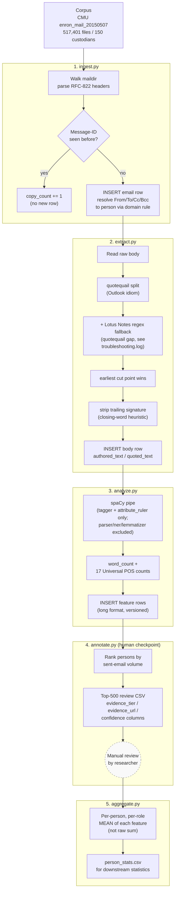

# Pipeline Architecture and Timing

**Status:** Reflects the Phase 1 implementation as built and smoke-tested (20,439 emails across
4 custodians: `skilling-j`, `lay-k`, `allen-p`, `sanders-r`). Full-corpus timings below are
extrapolations from measured smoke-test throughput, not a completed full run.

---

## 1. Pipeline diagram

Every stage after ingest reads its input by joining on `stage_status` for the *previous* stage's
version and writing its own `stage_status` row for its own version — see §3. No stage re-reads or
reprocesses an email already marked done at its current version, which is what makes the whole
pipeline safely re-runnable and resumable at 517k-file scale.

---

## 2. Approximate timing

All figures below are the measured smoke-test rate scaled linearly to the full corpus
(517,401 raw files). They are **estimates, not a completed full run**, and carry two open
uncertainties noted under each stage.

| Stage | Measured (smoke test, 20,439 emails) | Rate | Full-corpus estimate |
|---|---|---|---|
| **1. Ingest** | 1m 33s | 219 files/sec | **~39 minutes** |
| **2. Extract** | 3m 07s | 109 emails/sec | **~1.3 hours** |
| **3. Analyze** | 8m 40s (CPU) / see below (GPU) | 14.8–39.4 docs/sec (CPU, contention-dependent); 22–30 docs/sec (GPU) | **~4.8–9.7 hours** |
| **4. Annotate** | not yet run at scale | SQL aggregate + CSV write | seconds, negligible |
| **5. Aggregate** | not yet run at scale | SQL aggregate + CSV write | low minutes |

**Total estimated wall-clock for a full run: roughly 6–11 hours**, overwhelmingly dominated by
the analyze stage. Ingest and extract together are under 2 hours.

### Why the analyze stage has a wide range

This machine runs multiple concurrent Claude Code sessions. Measured CPU throughput for the
analyze stage varied from **39.4 docs/sec** (light load) down to **14.8 docs/sec** (load average
17–38, one competing process observed pegging ~26 cores). GPU throughput measured in the
**22–30 docs/sec** band regardless of available VRAM (freeing ~9GB of GPU memory by killing a
competing process made no measurable difference — see `troubleshooting.log`, 2026-08-22 entries).

The conclusion drawn from that investigation: the bottleneck is **CPU-side tokenization and
Python-level orchestration**, not GPU compute or VRAM, and it fluctuates with whatever else is
running on the machine at the time — not with any pipeline configuration choice. GPU is used as
the default for the full run because it is the more *predictable* option (it doesn't compete with
other sessions for CPU cores), not because it is dramatically faster.

### The two open uncertainties

1. **Real duplicate rate at full scale is unmeasured.** The 4-custodian smoke test happened to
   show zero true Message-ID duplicates (§8 of `docs/prior-work-survey.md` flags this as an
   outstanding action item). At the full 150-custodian scale, cross-mailbox duplication is
   expected to be substantially higher, which would *reduce* the real unique-email count below
   517,401 and shorten both the extract and analyze stages accordingly. The estimates above use
   the raw file count as a conservative (upper-bound) input.
2. **Machine load is not under this pipeline's control.** The analyze-stage range above reflects
   load conditions observed during development (2026-08-22), not a guarantee. A full run started
   during a quiet period could land near the low end (~4.8 hours); started during heavy
   concurrent use, nearer the high end.

---

## 3. Stage detail

**1. Ingest** — walks the maildir tree, parses RFC-822 headers only (no body work), deduplicates
on `Message-ID` with a running `copy_count`, and resolves every `From`/`To`/`Cc`/`Bcc` address to
a `person` row via the domain rule (`enron.com` → Employee, else Other). Zero errors across
20,439 files in the smoke test.

**2. Extract** — separates authored text from quoted/forwarded text. Primary splitter is
`quotequail` (Outlook-idiom aware); a supplementary regex catches the Lotus Notes quote idiom
that quotequail's pattern set does not model, which is common in this corpus (`X-Folder` headers
reference "Notes Folders"). Whichever cut point comes first — quotequail's or the regex's — wins.
This is a heuristic, not a validated parser: `docs/prior-work-survey.md` §3.1/§7 calls for
hand-annotating 300–500 bodies and reporting precision/recall before results are trusted, and that
validation has not yet been done.

**3. Analyze** — the Phase 1 placeholder feature set: word count plus counts of all 17 Universal
POS tags, computed with spaCy's `en_core_web_sm` (`tagger` + `attribute_ruler` only; `parser`,
`ner`, and `lemmatizer` excluded as unnecessary for this feature set and confirmed not to affect
POS-tag output). Features are written in long format (`email_id, feature_set_version,
feature_name, value`), so the real feature list arriving later adds rows, not a schema migration.

**4. Annotate** — a human checkpoint, not an automated stage. Ranks persons by authored-email
volume and emits a review CSV with placeholder evidence columns (`evidence_tier`, `evidence_url`,
`evidence_quote`, `confidence`) for manual role annotation, per `docs/methodology-briefing.md` §3.
No evidence is invented — cells are left blank where no genuine external record exists.

**5. Aggregate** — rolls feature rows up to per-person, per-role statistics using **per-email
means**, not raw sums, so a high-volume sender does not dominate a group statistic simply by
writing more email (`docs/methodology-briefing.md` §4).

---

## 4. Related documents

- `docs/methodology-briefing.md` — experimental design circulated to the University of Lancashire
  partners (labelling scheme, person-disjoint evaluation, temporal controls).
- `docs/prior-work-survey.md` — literature and tooling survey, including the extractor-library
  decision this pipeline implements.
- `troubleshooting.log` — dated record of every bug found and fix applied, including the
  quotequail/Lotus-Notes gap and the CPU-contention/GPU-throughput investigation behind §2 above.
